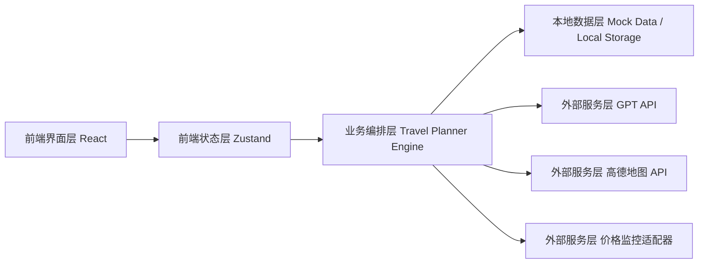
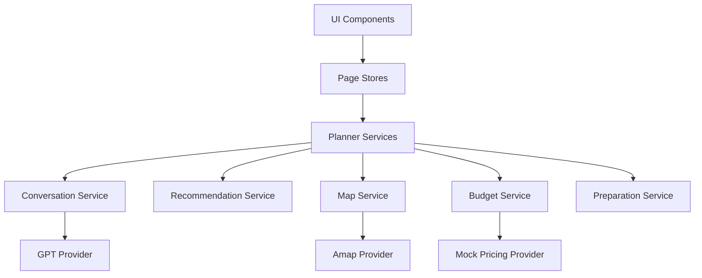
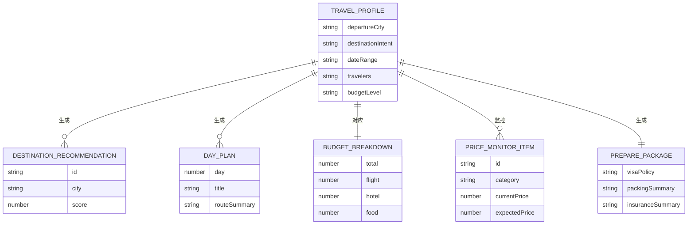

## 1. 架构设计


## 2. 技术描述
- 前端：React 18 + TypeScript + Vite
- 样式：Tailwind CSS 3 + CSS 变量 + 自定义动画
- 状态管理：Zustand
- 路由：React Router
- 图表：Recharts
- 地图：高德地图 JavaScript API
- 数据持久化：Local Storage
- 初始化工具：Vite

## 3. 路由定义
| 路由 | 用途 |
|-------|---------|
| / | 对话首页，负责欢迎屏、需求收集与快捷入口 |
| /plan | 展示目的地候选、行程路线、预算分配和核心推荐 |
| /prepare | 展示价格监控、签证政策、打包清单、穿搭与保险建议 |

## 4. API 定义
本项目首版采用“前端主导 + 本地适配层”的方式，避免在第一阶段引入必须部署的后端服务。所有第三方密钥放在单独目录并通过本地环境变量读取。后续可平滑升级为独立后端。

### 4.1 核心 TypeScript 类型
```ts
export type TravelProfile = {
  departureCity: string
  destinationIntent: string
  dateRange: string
  travelers: string
  budgetLevel: string
  travelStyle: string[]
  accommodationPreference: string
  transportPreference: string
  visaStatus?: string
  notes?: string
}

export type DestinationRecommendation = {
  id: string
  city: string
  country?: string
  score: number
  reasons: string[]
  highlights: string[]
  coverImage: string
}

export type DayPlan = {
  day: number
  title: string
  routeSummary: string
  spots: {
    time: string
    name: string
    type: "景点" | "餐饮" | "交通" | "酒店"
    note: string
    lat?: number
    lng?: number
    cost?: number
  }[]
}

export type BudgetBreakdown = {
  total: number
  flight: number
  hotel: number
  food: number
  transportation: number
  tickets: number
  insurance: number
  flexible: number
}

export type PriceMonitorItem = {
  id: string
  category: "机票" | "酒店"
  target: string
  currentPrice: number
  expectedPrice: number
  trend: number[]
  status: "观察中" | "接近低价" | "建议立即预订"
}
```

### 4.2 前端服务接口
| 接口名 | 输入 | 输出 | 说明 |
|-------|------|------|------|
| `collectConversationTurn` | 用户输入文本、当前画像 | 新消息、缺失字段、推荐追问 | 对话收集需求 |
| `buildTravelPlan` | 旅行画像 | 目的地推荐、每日行程、预算、准备建议 | 生成完整旅行方案 |
| `buildRouteMapData` | 每日行程 | 地图点位与路线数组 | 转换为地图展示数据 |
| `buildPriceMonitor` | 目的地、日期、预算 | 价格监控卡片 | 生成监控模块数据 |
| `buildPolicyAndPacking` | 目的地、日期、天气、旅行画像 | 政策、清单、穿搭、保险建议 | 生成准备页内容 |

## 5. 服务架构图
首版无独立后端，因此业务服务以内聚前端模块形式组织：



## 6. 数据模型
### 6.1 数据模型定义


### 6.2 数据定义说明
- `TravelProfile` 存储对话收集结果，并作为所有后续生成流程的统一输入。
- `DestinationRecommendation` 保存候选目的地及推荐原因，用于卡片展示和切换。
- `DayPlan` 为逐日行程结构，同时为地图路线与预算统计提供基础数据。
- `BudgetBreakdown` 负责预算汇总、图表展示和超支建议。
- `PriceMonitorItem` 用于展示机票和酒店监控状态，第一版允许使用模拟趋势数据与用户阈值。
- `PreparePackage` 聚合签证政策、注意事项、打包清单、穿搭建议和保险建议。

## 7. 密钥与目录规划
- 单独创建 `secrets/` 目录存放 `gpt.env.example`、`amap.env.example` 与用户私有密钥文件。
- 真实密钥建议写入 `secrets/local.keys.env`，并通过 `.gitignore` 排除。
- 前端通过 `import.meta.env` 读取运行时变量；若用户后续接入后端，可将密钥迁移到服务端。

## 8. 首版实现边界
- 优先实现完整可交互 UI 和前端旅行规划流程，确保 8 个功能均有可用页面与逻辑闭环。
- GPT API 与高德地图 API 设计为可插拔适配器，用户未填密钥时自动降级到本地演示数据。
- 机票/酒店价格监控首版提供可视化监控卡与趋势模拟，预留后续接第三方票价源的接口。
